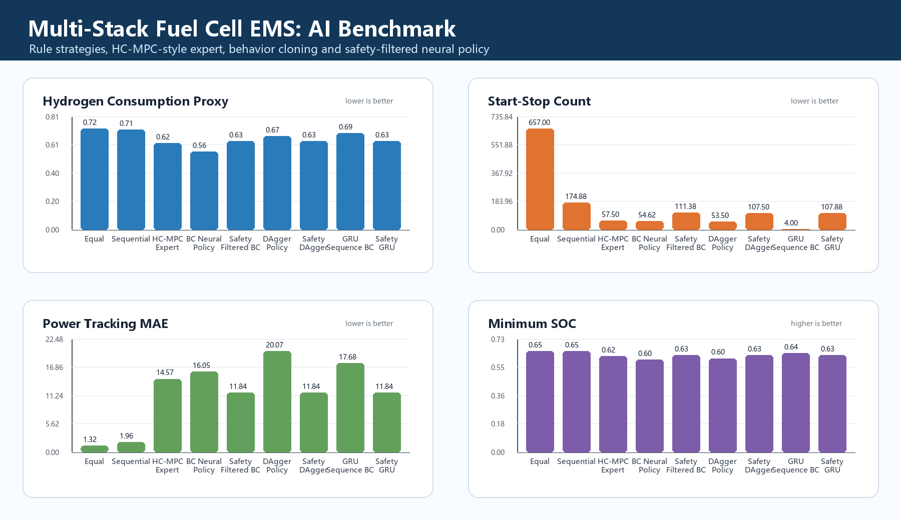

# Multi-Stack Fuel Cell AI Energy Management

This repository contains a resume-ready extension of a multi-stack fuel-cell hybrid energy management project. It combines the original MATLAB simulation idea with a Python AI pipeline:

- rule-based equal allocation
- sequential stack loading
- HC-MPC-style health-aware expert policy
- behavior cloning neural policy
- optional SAC reinforcement-learning fine-tuning

The goal is to compare fuel economy, SOC stability and SOH consistency under multiple control strategies.

## Project Highlights

- Built a lightweight Gymnasium environment for multi-stack fuel-cell power allocation.
- Designed a health-aware expert controller inspired by HC-MPC logic.
- Generated expert demonstrations and trained a PyTorch behavior cloning policy.
- Evaluated policies using hydrogen proxy, SOH range, SOH variance, SOC range and start-stop count.
- Kept optional SAC training entrypoint for future reinforcement-learning experiments.

For resume-oriented notes and future work, see [docs/resume_and_roadmap.md](docs/resume_and_roadmap.md).

## Repository Structure

```text
multi-stack/
├── python/multistack_ai/          # environment, expert policy, neural policy
├── scripts/                       # dataset, training and evaluation scripts
├── matlab/                        # selected original MATLAB simulation files
├── docs/                          # method notes
└── results/                       # generated outputs, ignored by Git
```

## Quick Start

```bash
pip install -r requirements.txt
python scripts/generate_expert_dataset.py --episodes 40
python scripts/train_bc.py --epochs 20
python scripts/evaluate_policies.py
python scripts/plot_policy_comparison.py
```

The comparison table will be written to:

```text
results/policy_comparison.csv
```

## Initial Benchmark Figure

The following figure is generated from `results/policy_comparison.csv`:



## Optional SAC Training

```bash
python scripts/train_sac_optional.py
```

The SAC path requires `stable-baselines3`. It is separated from the core pipeline so the supervised learning baseline remains easy to run.

## Resume Description

> Built a multi-stack fuel-cell hybrid energy management environment and designed an AI-based strategy pipeline. Generated HC-MPC-style expert demonstrations, trained a PyTorch behavior cloning policy for continuous stack power allocation, and compared rule-based, sequential, expert and neural policies on hydrogen consumption, SOC stability, SOH consistency and online inference readiness.

## Notes

The Python environment is a lightweight research abstraction of the original MATLAB project. It is intended for AI method development, fast experiments and resume/GitHub demonstration.
