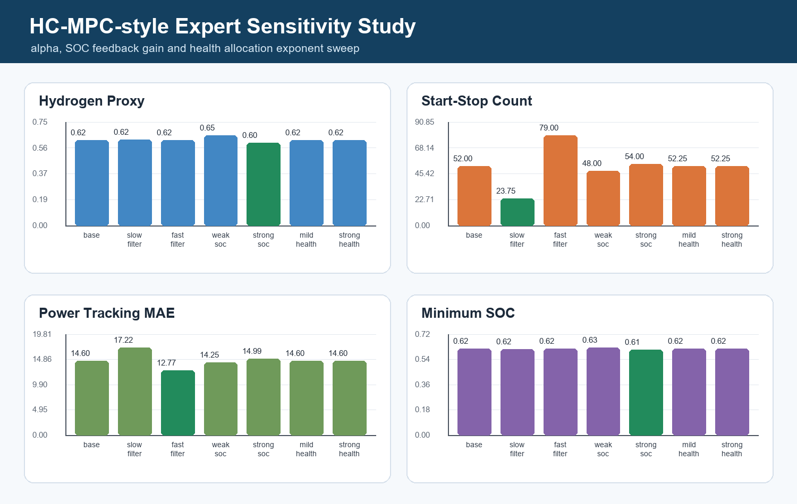
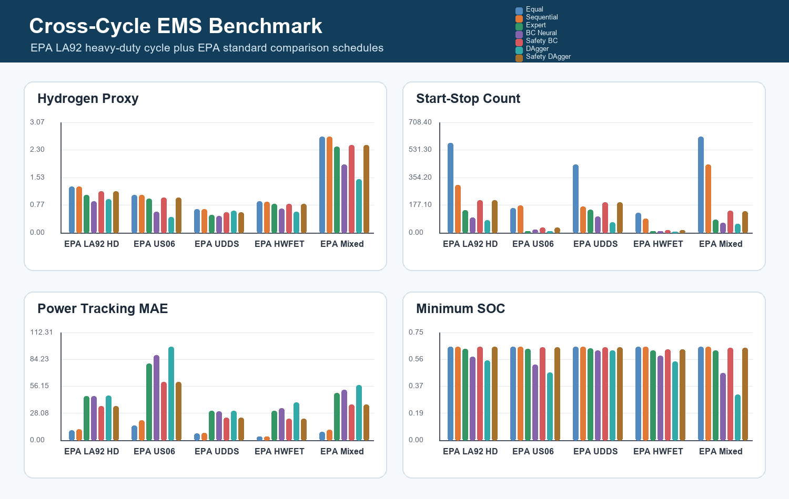
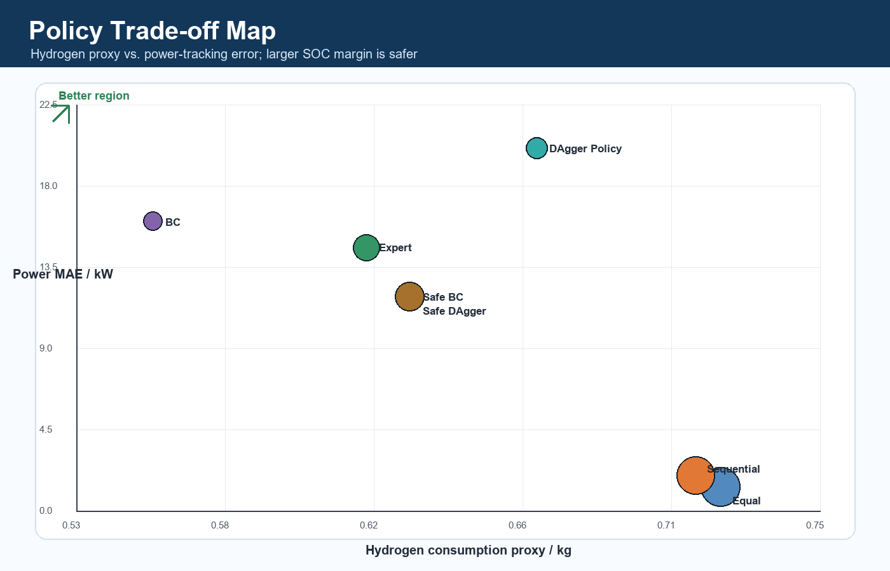
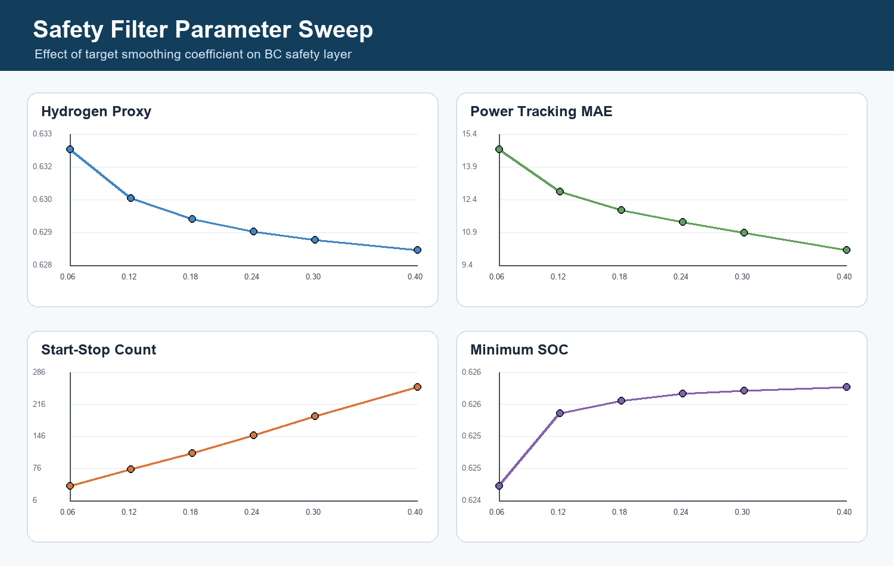

# Multi-Stack Fuel Cell AI Energy Management

A resume-ready AI extension of a multi-stack fuel-cell hybrid energy management project. The repository turns the original MATLAB simulation idea into a reproducible Python research platform for comparing rule-based control, HC-MPC-style expert control, behavior cloning and optional reinforcement learning.

## What This Project Does

The project studies how a hybrid fuel-cell/battery system should distribute power when four fuel-cell stacks have different health states. The controller must satisfy vehicle power demand while considering hydrogen consumption, battery SOC stability, stack start-stop events and SOH consistency.

Current strategy ladder:

1. **Equal allocation**: distributes fuel-cell power evenly across stacks.
2. **Sequential loading**: activates stacks in a fixed order.
3. **HC-MPC-style expert**: mimics the thesis control logic with demand smoothing, SOC feedback and health-aware asymmetric allocation.
4. **Behavior cloning neural policy**: learns the expert state-action mapping with PyTorch.
5. **Safety-filtered neural policy**: wraps the learned policy with SOC and stack-derating constraints.
6. **Optional SAC fine-tuning**: a reinforcement-learning entrypoint for future improvement.

## Highlights

- Built a Gymnasium environment for continuous multi-stack fuel-cell power allocation.
- Modeled SOC dynamics, stack SOH degradation, start-stop penalty, ramp-rate limits and stack derating.
- Generated HC-MPC-style expert demonstrations for supervised imitation learning.
- Trained a neural policy to approximate stack power allocation.
- Added a safety-filtered neural controller that improves SOC robustness and power tracking without retraining.
- Added a sensitivity study for expert-controller parameters: filter coefficient, SOC feedback gain and health-aware allocation exponent.
- Evaluated strategies using hydrogen proxy, SOC range, SOH variance, tracking error and start-stop count.
- Included selected MATLAB files from the original thesis simulation for traceability.

## Method Overview

```text
Driving demand + SOC + stack SOH + previous stack power
                         |
                         v
              Multi-stack EMS policy
      ------------------------------------------------
      Equal | Sequential | HC-MPC Expert | BC NN | Safe BC
      ------------------------------------------------
                         |
                         v
        Stack power commands + battery compensation
                         |
                         v
   SOC update, H2 proxy, SOH degradation, start-stop count
```

The neural policy is trained through behavior cloning:

```text
HC-MPC-style expert trajectories -> supervised dataset -> PyTorch MLP policy
```

This creates a stable AI baseline before adding SAC or constrained RL.

## Repository Structure

```text
multi-stack/
|-- python/multistack_ai/   # environment, expert policy, neural policy
|-- scripts/                # dataset generation, training, evaluation, plotting
|-- tests/                  # unit tests for environment, policies and reports
|-- matlab/                 # selected original MATLAB simulation files
|-- docs/                   # method notes, experiment design, benchmark notes, roadmap
|-- results/                # benchmark tables and generated comparison figures
|-- README.md
|-- requirements.txt
`-- LICENSE
```

## Quick Start

```bash
pip install -r requirements.txt
python scripts/generate_expert_dataset.py --episodes 40
python scripts/train_bc.py --epochs 20
python scripts/evaluate_policies.py
python scripts/plot_policy_comparison.py
python scripts/sensitivity_experiment.py
python scripts/evaluate_drive_cycles.py
python scripts/generate_experiment_report.py
python scripts/safety_filter_sweep.py
```

Run the automated checks:

```bash
pytest -q
```

Outputs:

```text
results/policy_comparison.csv
results/policy_comparison.png
results/sensitivity_study.csv
results/sensitivity_study.png
results/drive_cycle_benchmark.csv
results/drive_cycle_benchmark.png
results/experiment_report.md
results/pareto_tradeoff.png
results/safety_filter_sweep.csv
results/safety_filter_sweep.png
```

## Initial Benchmark

The current benchmark verifies that the full AI pipeline can run end-to-end. It is a lightweight Python abstraction for fast experimentation; the MATLAB model remains the thesis-grade reference simulation.


| Policy | H2 proxy | Start-stop count | Power MAE / kW | Min SOC |
|---|---:|---:|---:|---:|
| Equal | 0.7204 | 657.00 | 1.32 | 0.6500 |
| Sequential | 0.7131 | 174.88 | 1.96 | 0.6496 |
| HC-MPC-style Expert | 0.6174 | 57.50 | 14.57 | 0.6194 |
| BC Neural Policy | 0.5555 | 54.62 | 16.05 | 0.5973 |
| Safety-Filtered BC | 0.6301 | 111.38 | 11.84 | 0.6255 |

Interpretation: the raw BC policy achieves the lowest hydrogen proxy but leaves more demand to the battery. The safety-filtered BC policy raises SOC margin and reduces tracking error while keeping start-stop count below the sequential strategy, showing a practical trade-off between learning and engineering constraints.

## Project Progress

The repository now contains a tunable HC-MPC-style expert and a sensitivity study for `alpha`, `soc_gain` and `health_power`. This turns the control strategy into a set of comparable research baselines instead of a single fixed script.



Detailed notes:

- [Experiment design](docs/experiment_design.md)
- [Sensitivity study](docs/sensitivity_study.md)
- [Cross-cycle benchmark](docs/cross_cycle_benchmark.md)
- [Safety-filtered neural policy](docs/safety_layer.md)
- [Safety filter parameter sweep](docs/safety_filter_sweep.md)
- [Methodology](docs/methodology.md)
- [Resume and roadmap](docs/resume_and_roadmap.md)

## Cross-Cycle Benchmark

The project also evaluates each policy on representative urban, highway and mixed demand profiles to check robustness beyond a single random cycle.



## Experiment Report

The repository can automatically summarize the latest benchmark CSV files into a leaderboard and trade-off map.



See [results/experiment_report.md](results/experiment_report.md) for the generated report.

## Safety Filter Sweep

The safety layer includes a parameter sweep for the target smoothing coefficient, showing the trade-off between tracking correction and start-stop pressure.



## Engineering Quality

The project includes unit tests and a GitHub Actions workflow. The checks cover environment stepping, deterministic driving-cycle generation, safety-filtered policy behavior and report generation.

## Optional SAC Training

```bash
python scripts/train_sac_optional.py
```

The SAC path requires `stable-baselines3`. It is separated from the core pipeline so the behavior cloning baseline remains easy to reproduce.

## Resume Description

**AI-based energy management for multi-stack fuel-cell hybrid vehicles**

Built a Gymnasium simulation platform for a four-stack fuel-cell/battery hybrid system, implemented rule-based and HC-MPC-style expert baselines, generated expert demonstrations, trained a PyTorch behavior-cloning policy, and added a safety-filtered neural controller for SOC-aware action correction. Evaluated hydrogen consumption proxy, SOC stability, power tracking and start-stop behavior across random and representative driving cycles.

## Roadmap

- Replace the synthetic demand generator with standardized driving-cycle loaders.
- Add constrained SAC/DDPG fine-tuning and compare against behavior cloning and safety-filtered BC.
- Add multi-objective Pareto analysis for hydrogen economy, SOC safety and SOH consistency.
- Connect the Python AI policy back to the MATLAB simulation for higher-fidelity validation.

## Notes

This repository is intended for portfolio and research development. The Python environment is lightweight by design; it captures the core EMS trade-offs and keeps experiments fast enough for AI method iteration.
