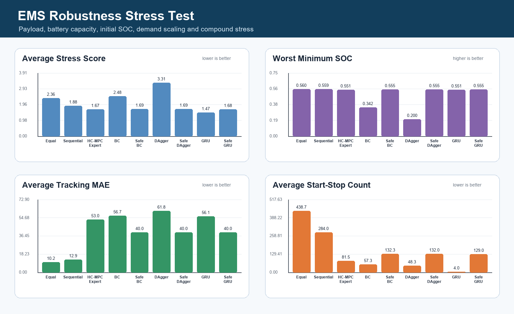

# Robustness Stress Test

This stress test evaluates policies under payload, battery-capacity, initial-SOC, demand-scaling and compound disturbances.

## Stress Scenarios

- `nominal_la92`: EPA LA92 baseline.
- `heavy_payload`: LA92 demand scaled by 1.18.
- `low_battery_capacity`: LA92 with smaller battery capacity.
- `low_initial_soc`: US06 with lower initial SOC.
- `aggressive_highway`: HWFET with demand scaling, smaller battery and tighter ramp limit.
- `compound_stress`: mixed EPA cycle with combined SOC, capacity, ramp and load stress.

## Takeaway

- Lowest average stress score: **GRU Sequence BC** (1.47).
- Best worst-case SOC margin: **Equal** (worst SOC 0.560).

This complements the nominal benchmark by checking whether learned controllers remain usable when vehicle and battery assumptions shift.
