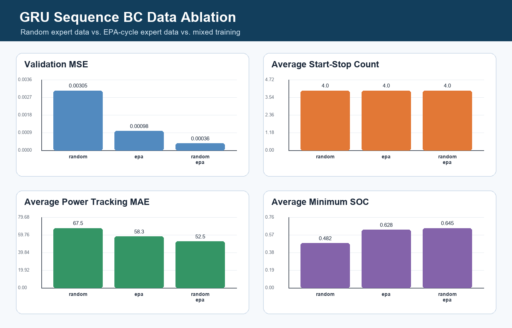

# Sequence BC Data Ablation

This ablation tests whether the GRU sequence policy benefits from adding EPA-cycle expert trajectories.

## Cases

- `random`: GRU trained only on random expert trajectories.
- `epa`: GRU trained only on EPA-cycle expert trajectories.
- `random+epa`: GRU trained on both sources.

## Takeaway

- Best average SOC margin: **random+epa** (SOC min 0.645).
- Smoothest dispatch: **random** (4.0 start-stop events on average).

The mixed-data result is the most useful portfolio finding: adding authoritative drive-cycle expert data reduces distribution shift while retaining the recurrent policy's smooth dispatch behavior.
