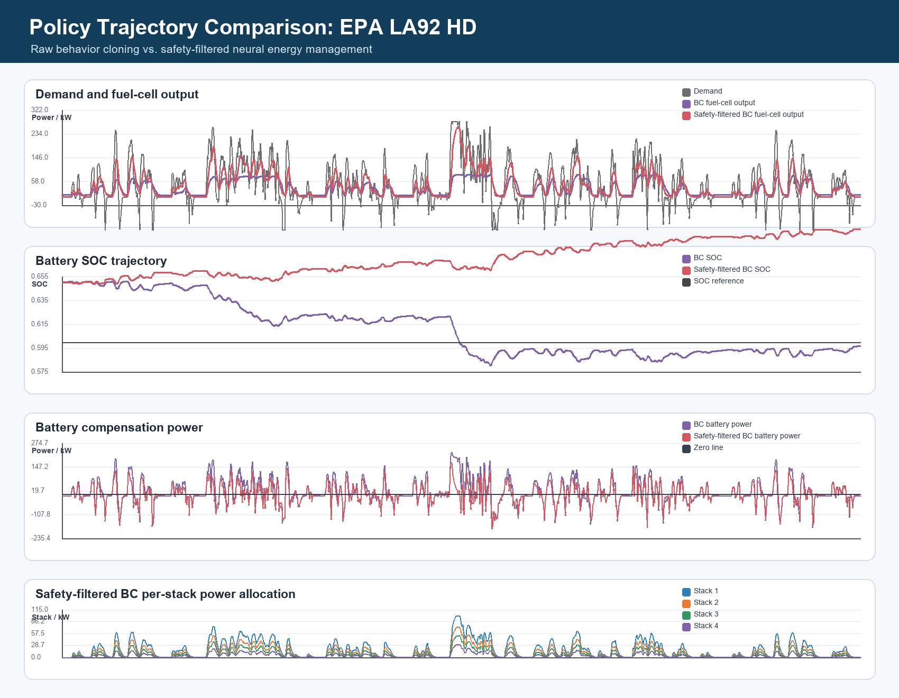

# Policy Trajectory Visualization

Aggregate metrics are useful, but they do not show how a policy behaves over time. This script generates a time-domain comparison between the raw behavior-cloning policy and the safety-filtered BC policy.

Run:

```bash
python scripts/plot_policy_trajectories.py --cycle epa_la92
```

Outputs:

```text
results/trajectory_comparison_epa_la92.png
results/trajectory_comparison_epa_la92.csv
```



## What The Figure Shows

The figure contains four views:

1. Vehicle demand vs. fuel-cell output.
2. Raw BC SOC vs. safety-filtered SOC.
3. Battery compensation power.
4. Per-stack power allocation under the safety-filtered policy.

This visualization helps explain why the safety layer improves SOC robustness: it asks the fuel-cell system to carry more of the low-frequency load and reduces excessive battery compensation.
